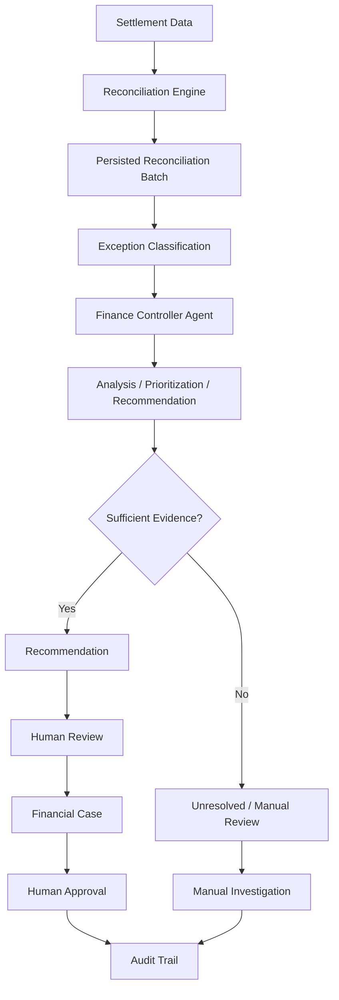

# AI Finance Controller

A settlement reconciliation system with AI-assisted exception analysis, safe failure handling, and human-controlled financial actions.

---

# Overview

The AI Finance Controller automates finance operations by reconciling settlement records against order/payment data, detecting exceptions, prioritizing investigations, and providing evidence-based recommendations—all while keeping consequential financial decisions under human control.

This is not a generic chatbot. It is a purpose-built finance workflow system that:

- Reconciles settlement batches against order records
- Detects and classifies exceptions (mismatches, duplicates, missing orders, malformed data)
- Analyzes and prioritizes exceptions using AI assistance
- Produces recommendations only when evidence supports them
- Escalates unresolved cases for manual investigation
- Maintains a complete audit trail of all actions

---

# Problem Statement

Finance teams must reconcile settlement records (from payment processors) against internal order and payment records. As transaction volume grows, manual reconciliation becomes impractical. Common challenges include:

- **Volume**: Hundreds or thousands of transactions require daily reconciliation
- **Exceptions**: Mismatches, duplicates, missing orders, and malformed records require investigation
- **Risk**: Incorrect automated decisions can lead to financial loss or compliance issues
- **Auditability**: Financial operations require traceable decision-making

The system addresses these challenges by automating repetitive analysis while ensuring that consequential financial actions remain under explicit human control.

---

# Solution

The implemented solution follows a structured workflow:

1. **Generate/Ingest Settlement Records**: Synthetic settlement batches are created for evaluation (59 records with deterministic seed)
2. **Reconcile Settlements**: Each settlement is matched against orders using reference-based matching with amount fallback
3. **Calculate Metrics**: Match rate and exception distribution are computed
4. **Classify Exceptions**: Settlements are classified into categories (matched, amount_mismatch, duplicate_settlement, no_matching_order, already_reconciled, malformed_incomplete)
5. **Persist Evidence**: Reconciliation results are stored with full evidence for audit
6. **Analyze with Finance Controller Agent**: Exception details are sent to the AI agent for analysis
7. **Prioritize & Explain**: The agent produces prioritized analysis with explanations
8. **Recommend Where Safe**: Recommendations are generated only when evidence is sufficient
9. **Escalate Unresolved Cases**: Cases with insufficient evidence are explicitly marked for manual review
10. **Human-Controlled Actions**: Financial case/approval workflows require explicit human action
11. **Maintain Audit Trail**: All actions and decisions are logged for compliance

---

# Key Features

- **Synthetic Settlement Batch Generation**: Deterministic, reproducible test datasets (random seed: 42)
- **50+ Record Reconciliation**: Evaluation dataset contains 59 settlement records
- **Match-Rate Calculation**: Computes percentage of settlements matched to orders
- **Reference-Based Matching**: Primary matching strategy using transaction references
- **Amount Fallback Matching**: Secondary matching when reference lookup fails
- **Amount Mismatch Detection**: Identifies settlements where amounts differ from orders
- **Duplicate Settlement Detection**: Prevents processing the same settlement twice
- **No Matching Order Detection**: Flags settlements without corresponding order records
- **Already Reconciled Detection**: Avoids re-processing previously reconciled transactions
- **Malformed/Incomplete Data Detection**: Validates required fields before matching
- **Finance Controller Agent**: AI-assisted exception analysis and prioritization
- **AI Response Validation**: Invalid model responses are rejected, not trusted
- **Deterministic Fallback**: System continues operating when Gemini API is unavailable
- **Safe Failure Handling**: Escalates cases rather than fabricating evidence
- **Manual-Review Escalation**: Insufficient evidence triggers human investigation
- **Financial Case Workflow**: Structured approval process for financial actions
- **Human Approval**: Consequential actions require explicit human authorization
- **Audit Logging**: Complete trail of all operations and decisions
- **Authentication**: Access control for financial operations

---

# Finance Controller Agent

The Finance Controller Agent is an AI-assisted analysis component that operates on persisted reconciliation evidence.

## What It Receives

- Actual reconciliation records with full evidence
- Exception classifications and supporting data
- Settlement details, order details, and mismatch information

## How It Works

1. **Analyzes Exceptions**: Reviews each exception category with available evidence
2. **Prioritizes Cases**: Ranks exceptions by risk, impact, and investigability
3. **Generates Explanations**: Provides human-readable reasoning for each classification
4. **Produces Recommendations**: Suggests actions only when evidence is sufficient
5. **Handles Insufficient Evidence**: Explicitly marks cases as unresolved/manual-review

## Safety Constraints

- **Read-Only**: The agent does not modify reconciliation records or execute financial actions
- **Validated Responses**: AI output is validated against expected schema; invalid responses are rejected
- **Deterministic Fallback**: When Gemini is unavailable, the system uses rule-based analysis
- **No Fabrication**: The agent does not invent order IDs, amounts, or financial evidence

---

# Safe Failure / Failure Handling

The system is designed to **fail safely** rather than invent financial evidence.

### Duplicate Settlements
The system identifies duplicate settlements and prevents duplicate financial processing. These cases are escalated rather than auto-resolved.

### Amount Mismatches
When settlement amounts differ from order amounts, the system displays actual vs. expected values. It does not invent a "corrected" amount.

### No Matching Order
When a settlement has no corresponding order record, the system does not fabricate an order ID. The case is escalated for manual investigation.

### Already Reconciled
Previously reconciled transactions are detected and not re-processed. The system avoids recommending duplicate reconciliation.

### Malformed/Incomplete Records
The reconciliation engine validates required fields. Records missing critical data are classified as `malformed_incomplete` rather than incorrectly matched.

### Insufficient Evidence
When evidence is insufficient to support a recommendation, the agent explicitly marks the case as **unresolved/manual review** rather than forcing an answer.

### Gemini/API Failure
When the Gemini API is unavailable or unconfigured, the system falls back to deterministic, rule-based analysis.

### Invalid AI Response
Model responses that fail validation are rejected. The system does not trust invalid output.

> **Design Principle**: The system is designed to fail safely rather than invent financial evidence.

---

# Architecture



---

# Reconciliation Workflow

The reconciliation algorithm processes settlement records through the following steps:

1. **Settlement Batch Creation**: Synthetic settlements are generated with controlled characteristics (seed: 42)
2. **Reference Matching**: Primary lookup using transaction reference/order ID
3. **Amount Fallback**: If reference lookup fails, attempt amount-based matching
4. **Amount Mismatch**: If reference matches but amounts differ, classify as `amount_mismatch`
5. **Duplicate Detection**: Check if settlement was previously processed; classify as `duplicate_settlement`
6. **No Matching Order**: If no order found via reference or amount, classify as `no_matching_order`
7. **Already Reconciled**: Check reconciliation status; classify as `already_reconciled` if complete
8. **Malformed/Incomplete Validation**: Validate required fields; classify invalid records as `malformed_incomplete`
9. **Persistence**: Store reconciliation results with full evidence
10. **Match-Rate Calculation**: Compute `matched_count / total_count` percentage

### Classifications Used

| Classification | Description |
|---|---|
| `matched` | Settlement successfully matched to order with consistent amount |
| `amount_mismatch` | Reference matched but settlement amount differs from order |
| `duplicate_settlement` | Settlement was already processed previously |
| `no_matching_order` | No corresponding order record found |
| `already_reconciled` | Transaction was previously reconciled |
| `malformed_incomplete` | Record missing required fields or invalid format |

---

# AI Architecture

## Configuration

- **AI Provider**: Google Gemini (when `GEMINI_API_KEY` is configured)
- **Fallback**: Deterministic rule-based analysis when Gemini is unavailable

## Prompt/Evidence Strategy

- Reconciliation evidence is persisted and passed to the agent
- Exception details include all relevant fields for analysis
- Context includes classification rules and safety constraints

## Response Schema

- Expected structured output with prioritization, explanations, and recommendations
- Schema validation rejects malformed responses

## Safety Constraints

- Read-only access to reconciliation data
- No autonomous financial actions
- Explicit handling of insufficient evidence
- Validation before accepting AI output

## Important Note

> The final evaluation was performed **WITHOUT Gemini** because `GEMINI_API_KEY` was not configured. All classification results reflect deterministic reconciliation logic, not AI model accuracy.

---

# Evaluation

## Dataset

| Property | Value |
|---|---|
| Total Records | 59 |
| Type | Synthetic settlement records |
| Reproducibility | Deterministic (random seed: 42) |

## Classification Results

| Classification | Count |
|---|---:|
| matched | 38 |
| amount_mismatch | 4 |
| duplicate_settlement | 3 |
| no_matching_order | 4 |
| already_reconciled | 5 |
| malformed_incomplete | 5 |
| **Total** | **59** |

## Ground Truth Validation

- **59/59 classifications** matched the predefined synthetic ground-truth rules
- **Classification consistency: 100% (59/59)** against predefined synthetic ground-truth rules

> **Important**: This is an **internal validation result**, not external real-world validation or Gemini model accuracy.

## Match Rate

- **38/59 = 64.41%** match rate

> Match rate measures the percentage of settlements successfully matched to orders. This is distinct from classification consistency.

---

# Honest Exceptions

The following cases were intentionally **NOT** automatically resolved:

| Classification | Count | Reason |
|---|---:|---|
| no_matching_order | 4 | Insufficient evidence to identify order |
| duplicate_settlement | 3 | Risk of duplicate financial processing |
| **Total Unresolved** | **7** | Escalated for manual investigation |

> **7 unresolved cases are a deliberate safe-failure outcome, not hidden failures.**

The system does not force automatic resolution when evidence is insufficient or when doing so would risk duplicate financial processing.

---

# Throughput

> **6,279 records/sec** — Reconciliation-engine throughput measured in a deterministic, in-memory benchmark.

### Qualifications

This benchmark:
- ✅ Measures reconciliation-engine performance
- ✅ Uses in-memory operations
- ✅ Is deterministic and reproducible

This benchmark **excludes**:
- ❌ Gemini/LLM inference latency
- ❌ Network latency
- ❌ Production database persistence overhead
- ❌ Financial case workflow overhead
- ❌ Human approval workflow

> **Do NOT interpret this as "AI throughput" or "end-to-end system throughput".**

---

# Testing

## Test Results

**61/61 tests passing**

| Component | Tests Passing |
|---|---:|
| Finance Controller Agent | 27/27 |
| Reconciliation | 8/8 |
| Financial Approval | 25/25 |
| Evaluation | 1/1 |

## Test Coverage

- **Finance Controller Agent**: Response validation, fallback behavior, exception analysis, prioritization logic
- **Reconciliation**: Matching algorithms, exception classification, duplicate detection, malformed record handling
- **Financial Approval**: Case creation, approval workflow, audit logging, access control
- **Evaluation**: Synthetic dataset generation, ground-truth validation, metric calculation

---

# Razorpay Track 04 Alignment

| Track 04 Requirement | How This Project Addresses It |
|---|---|
| 50+ synthetic records | 59-record reproducible evaluation dataset (seed: 42) |
| Measured reconciliation | 64.41% match rate (38/59) |
| Exception handling | 6 exception classifications (matched, amount_mismatch, duplicate_settlement, no_matching_order, already_reconciled, malformed_incomplete) |
| Honest unresolved cases | 7 cases escalated for manual investigation (4 no_matching_order + 3 duplicate_settlement) |
| Throughput | 6,279 records/sec reconciliation-engine benchmark (in-memory, excludes LLM/network/DB) |
| AI-assisted finance operations | Finance Controller Agent with validated responses and deterministic fallback |
| Safe financial operations | Read-only analysis + human-controlled approval workflow |
| Measurable validation | 61/61 automated tests + synthetic evaluation with ground-truth comparison |

---

# Tech Stack

| Technology | Usage |
|---|---|
| Python | Core application logic |
| Flask | Web framework and API |
| SQLite | Database for persistence |
| HTML/CSS/JavaScript | Frontend templates |
| Google Gemini API | AI provider (when configured) |
| Faker | Synthetic data generation |
| pytest | Test framework |

---

# Project Structure

```
.
├── app.py                      # Flask application, routes, views
├── finance_controller_agent.py # AI agent implementation
├── reconciliation.py           # Reconciliation engine
├── models.py                   # Database models
├── templates/
│   ├── dashboard.html          # Main dashboard view
│   ├── reconciliation_detail.html  # Exception detail view
│   └── ...                     # Additional templates
├── static/
│   ├── css/                    # Stylesheets
│   └── js/                     # Client-side scripts
├── tests/
│   ├── test_finance_controller_agent.py
│   ├── test_reconciliation.py
│   ├── test_financial_approval.py
│   └── test_evaluation.py      # Synthetic evaluation tests
├── instance/
│   └── catering.db             # SQLite database
├── requirements.txt            # Python dependencies
├── .env                        # Environment configuration
└── README.md                   # This file
```

---

# Setup & Installation

## Prerequisites

- Python 3.8+
- pip
- Virtual environment tool (venv)

## Installation Steps

```bash
# 1. Clone repository
git clone <repository-url>
cd <repository-directory>

# 2. Create virtual environment
python -m venv venv

# 3. Activate environment
# On Linux/macOS:
source venv/bin/activate
# On Windows:
# venv\Scripts\activate

# 4. Install dependencies
pip install -r requirements.txt

# 5. Configure environment variables
# Create .env file with:
# GEMINI_API_KEY=your_api_key_here  # Optional, for AI features
# FLASK_APP=app.py
# FLASK_ENV=development
# SECRET_KEY=your_secret_key_here

# 6. Initialize database
flask db init    # If using Flask-Migrate
# Or let Flask create tables on first run

# 7. Run Flask application
flask run

# 8. Open local URL
# Navigate to: http://127.0.0.1:5000
```

## Environment Variables

| Variable | Required | Description |
|---|---|---|
| `FLASK_APP` | Yes | Flask application entry point |
| `SECRET_KEY` | Yes | Session security key |
| `GEMINI_API_KEY` | No | Google Gemini API key (AI features) |
| `DATABASE_URL` | No | Database connection string (defaults to SQLite) |

---

# Demo Flow

A 5-minute presentation flow for Razorpay Buildathon judges:

1. **Open Admin Dashboard** (`http://127.0.0.1:5000/`)
   - Show overview of settlement batches

2. **Generate/View Reconciliation Batch**
   - Demonstrate synthetic batch generation (59 records)
   - Show batch creation timestamp and status

3. **Display Settlement Metrics**
   - Total settlements: 59
   - Match rate: 64.41% (38/59)
   - Exception distribution chart

4. **Show Exception Distribution**
   - Breakdown by classification type
   - Highlight non-matched categories

5. **Open Exception List**
   - Navigate to detailed exception view
   - Show paginated list of exceptions

6. **Run Finance Controller Agent**
   - Trigger AI analysis on exceptions
   - Show analysis in progress

7. **Display Prioritized Analysis**
   - Show ranked exceptions by priority
   - Display AI-generated explanations

8. **Show Explanation/Recommendation**
   - Pick a matched exception with recommendation
   - Show evidence-backed suggestion

9. **Demonstrate Unresolved Case**
   - Open a `no_matching_order` exception
   - Show "Insufficient Evidence" status
   - Highlight manual review requirement

10. **Emphasize Safe Failure**
    - Explain why case was NOT auto-resolved
    - Show system prefers escalation over fabrication

11. **Demonstrate Human-Controlled Workflow**
    - Create a financial case
    - Show approval pending state
    - Execute human approval action

12. **Show Audit Trail**
    - Navigate to audit log
    - Display timestamped actions
    - Show user attribution

13. **Present Evaluation Results**
    - Mention 59-record evaluation dataset
    - Show 100% classification consistency (59/59)
    - Clarify this is internal validation, not external accuracy
    - Mention 61/61 passing tests

14. **Highlight Throughput Benchmark**
    - State 6,279 records/sec
    - Clarify this is reconciliation-engine throughput (in-memory)
    - Note exclusions (LLM, network, DB, human workflow)

---

# Human Control & Safety

## Safety Design Principles

| Principle | Implementation |
|---|---|
| **Read-Only AI** | Finance Controller Agent analyzes but does not modify data |
| **Validated Responses** | AI output validated against schema; invalid responses rejected |
| **Deterministic Fallback** | System operates when Gemini is unavailable |
| **No Evidence Fabrication** | Missing data is not invented; cases escalated instead |
| **Explicit Escalation** | Unresolved cases clearly marked for manual review |
| **Human Authorization** | Financial actions require explicit human approval |
| **No Auto-Modification** | Existing reconciliation records unchanged by analysis |
| **Complete Auditability** | All actions logged with timestamps and user attribution |

## Why This Matters

Financial operations have real-world consequences. Automated systems must:

- Avoid false positives that could cause financial loss
- Maintain clear accountability for decisions
- Provide auditable trails for compliance
- Escalate uncertain cases rather than guessing

This system prioritizes **safety over automation**.

---

# Limitations

Be transparent about current limitations:

| Limitation | Details |
|---|---|
| **Synthetic Data** | Evaluation uses synthetically generated settlement records, not real production data |
| **Internal Validation** | 100% classification consistency is against predefined synthetic rules, not external benchmarks |
| **No Gemini in Evaluation** | Final evaluation ran without Gemini API; AI features were not measured |
| **In-Memory Throughput** | 6,279 records/sec is an in-memory benchmark excluding database, network, and LLM latency |
| **Manual Investigation Required** | 7 of 59 cases (11.9%) intentionally require human review |
| **Limited Reconciliation Strategies** | Current implementation uses reference and amount matching; more strategies possible |
| **Single AI Provider** | Currently configured for Gemini; multi-provider support not implemented |

These limitations are acknowledged design choices, not hidden deficiencies.

---

# Future Improvements

Potential enhancements for production deployment:

- **Production Integrations**: Connect to real payment processor settlement APIs (Razorpay, Stripe, etc.)
- **External Validation**: Test against real-world historical reconciliation datasets
- **Expanded Matching**: Add fuzzy matching, date-range matching, partial amount matching
- **Multi-Provider AI**: Support multiple LLM providers with automatic failover
- **Production Benchmarking**: Measure end-to-end throughput including database, network, and human workflow
- **Enhanced Workflows**: Additional financial operation types beyond current approval flow
- **Role-Based Access**: Granular permissions for different finance team roles
- **Real-Time Processing**: Stream-based reconciliation instead of batch processing

These are **future considerations**, not current features.

---

# Final Summary

This project demonstrates a **measurable, evidence-based Finance Controller workflow** that:

1. **Reconciles** settlement batches against order records
2. **Identifies and prioritizes** exceptions using AI-assisted analysis
3. **Uses deterministic fallback** when AI services are unavailable
4. **Fails safely** when evidence is insufficient, escalating rather than fabricating
5. **Keeps consequential financial actions** under explicit human control
6. **Maintains complete auditability** for compliance and accountability

With **61/61 passing tests**, **100% classification consistency** on synthetic evaluation, and intentional safe-failure design, this system embodies the principles of responsible AI in financial operations.

---

*Submitted for Razorpay Buildathon 2025 — Track 04: AI Finance Controller*
